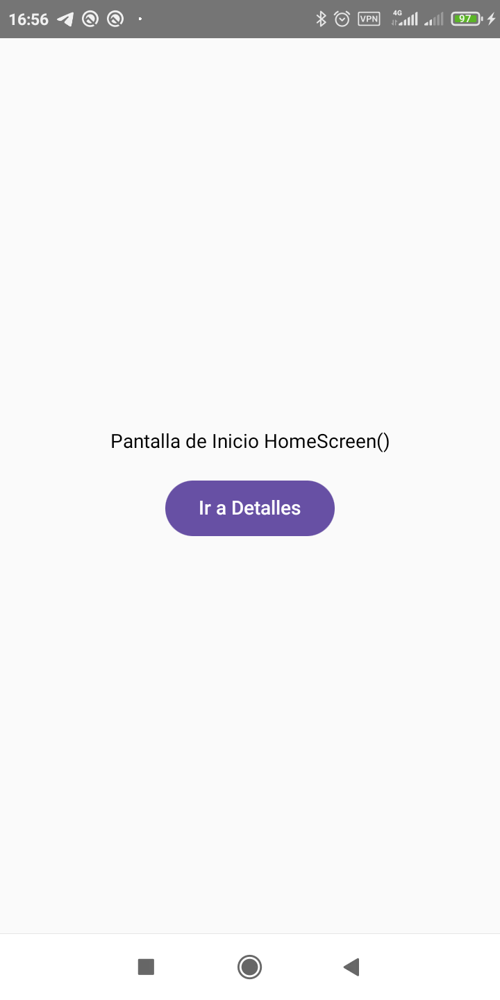
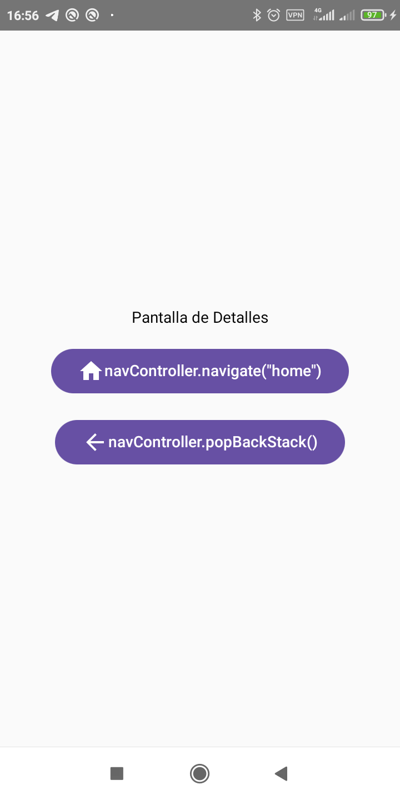

## UD2_06_Navigation
Esta aplicación de Android muestra cómo implementar navegación básica en Jetpack Compose. Se incluyen dos pantallas: una pantalla de inicio y una pantalla de detalles, con navegación entre ellas utilizando NavController y NavHost.

Basicamente la navegacion es una conmutacion entre dos funciones compose (pantallas), contenidas en el widget NavHost()

<figure>
    
    <figcaption>Vista de la aplicación</figcaption>
</figure>
<figure>
    
    <figcaption>Vista de la aplicación</figcaption>
</figure>

## Configuración de Dependencias
Para que NavController funcione, se requiere agregar ciertas lineas de texto en ciertos archivos de gradle:

### /gradle/libs.versions.toml
En el apartado libraries agregamos esta linea:
androidx-navigation-compose = { module = "androidx.navigation:navigation-compose", version = "2.8.3" }

### /App/build.gradle.kts
En el apartado dependencies agregamos esta linea:
androidx-navigation-compose = { module = "androidx.navigation:navigation-compose", version = "2.8.3" }

## Características
- Navegación entre pantallas: Se navega entre la pantalla de inicio y la de detalles usando NavController.
- Componentes personalizados: Cada pantalla incluye un diseño simple con Text, Button y Icon que demuestran cómo navegar y volver a la pantalla anterior.
- Navegación hacia atrás: Desde la pantalla de detalles, se puede regresar a la pantalla anterior usando navController.popBackStack().

## Estructura del Proyecto
El código principal de la aplicación se encuentra en MainActivity.kt e incluye los siguientes componentes:

- MainActivity: Configura la actividad principal de la aplicación y establece el contenido con MyApp.
- MyApp: Define el NavHost para controlar las rutas y el navController para navegar entre las pantallas.
- HomeScreen: Pantalla inicial con un botón que permite navegar a la pantalla de detalles.
- DetailScreen: Pantalla de detalles con dos botones, uno para regresar a la pantalla de inicio y otro para navegar hacia atrás en la pila de navegación.

## Código Principal
La función MyApp crea un NavHost que define las rutas de navegación:

"home": Pantalla de inicio que carga HomeScreen.
"detail": Pantalla de detalles que carga DetailScreen.
